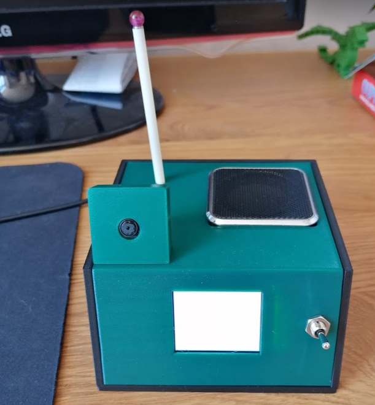

# eye-blink-box
A Raspberry Pi camera project using computer vision to determine a blinking eye and responding with a gif on an lcd display and a sound

## Get it up and running
Project is developed in a Python virtual environment

````
cd eye-blink/
workon cv
python final_wink_detection.py
```` 


## Hardware

### BOM
- Raspberry Pi 4/3b+
- [Raspberry Pi Camera Rev 1.3 or better](https://www.az-delivery.de/en/products/raspberrykamerav1-3)
- [1.8 inch SPI TFT display 128 x 160 pixels](https://www.az-delivery.de/en/collections/displays/products/1-8-zoll-spi-tft-display#description)
- old headphones or music box
- 1x double-switch

### Wiring

## Software setup

1. Setup your Raspberry Pi with the latest OS with Desktop environment
2. Follow this tutorial from [PyImageSearch](https://www.pyimagesearch.com/2017/04/24/eye-blink-detection-opencv-python-dlib/) to setup all required libraries for the face recognition.
3. Install adafruit libraries for the lcd display
````
workon cv
#make sure you use python3
pip3 install RPI.GPIO
pip3 install adafruit-blinka
pip3 install adafruit-io
pip3 install adafruit-circuitpython-rgb-display
````



